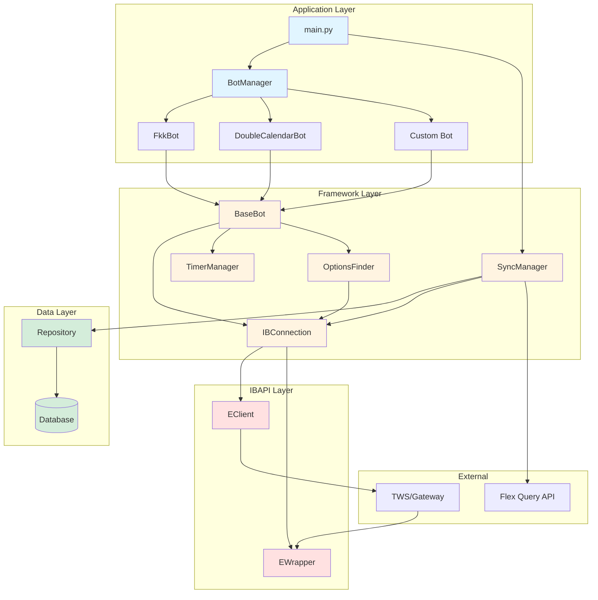
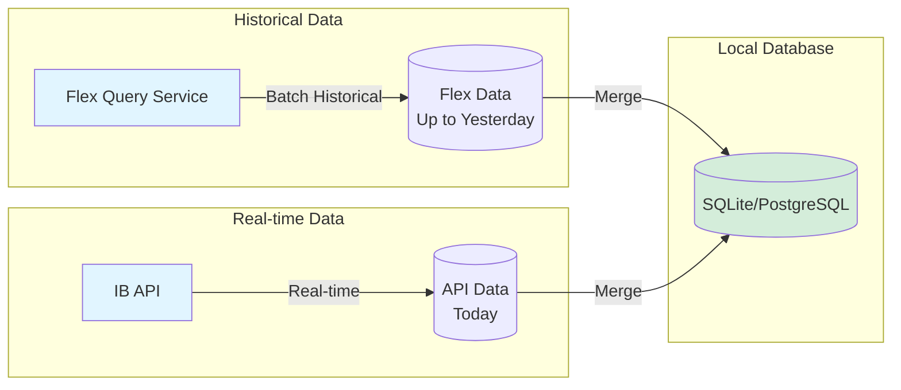
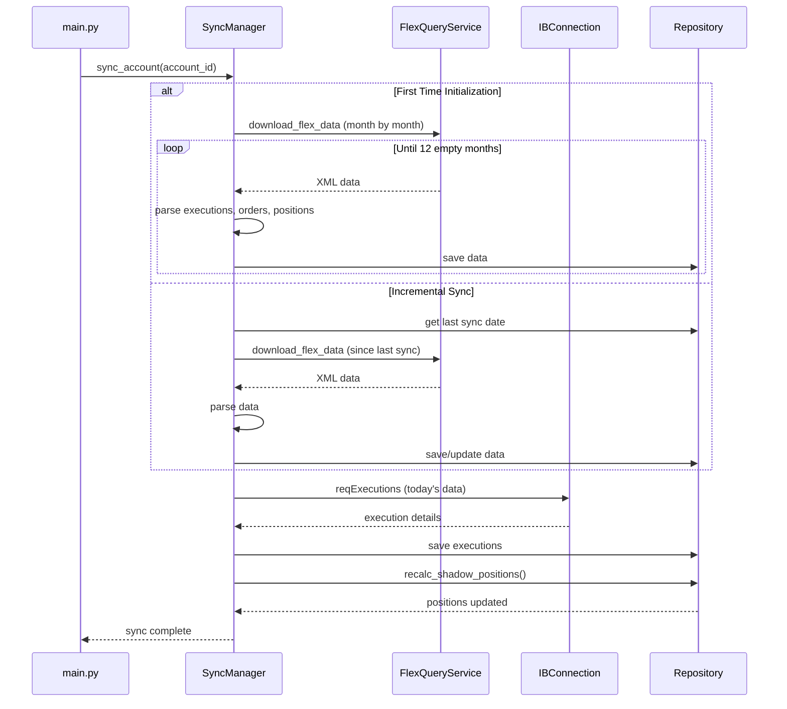
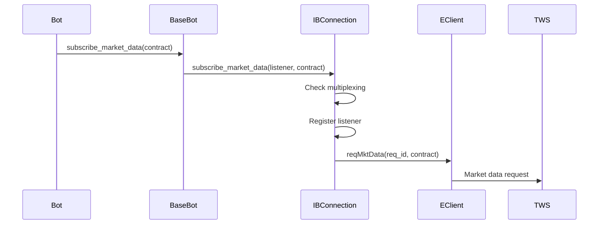
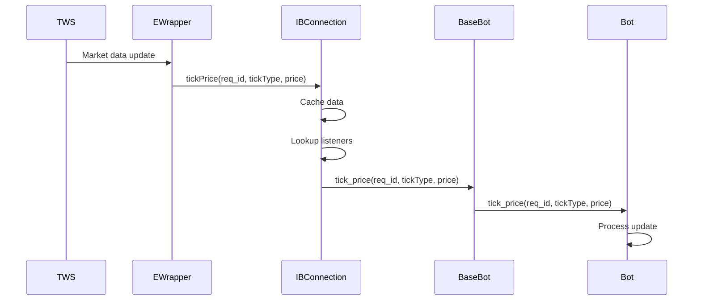

# Trading Bot Farm Framework - Overview

## Introduction

The Trading Bot Farm Framework is a Python-based system for running multiple automated trading bots that share a single connection to Interactive Brokers TWS (Trader Workstation) via the IBAPI. The framework provides a robust, asynchronous architecture that handles the complexity of IBAPI interactions while offering a simplified interface for bot development.

## Core Design Principles

### 1. **Resource Efficiency**
- Single shared connection to TWS for all bots
- Request multiplexing for market data subscriptions
- Intelligent caching of market data, positions, and account information

### 2. **Separation of Concerns**
- [`IBConnection`](../src/ib_connection.py) handles all IBAPI communication (EClient/EWrapper)
- [`BaseBot`](../src/bots/base_bot.py) provides a simplified facade for bot development
- [`BotManager`](../src/bot_manager.py) orchestrates bot lifecycle and discovery

### 3. **Asynchronous by Design**
- Request/response pattern using `req_id` correlation
- Callback-based API for handling asynchronous responses
- Event-driven timer system for scheduled operations

### 4. **Extensibility**
- Simple bot creation through inheritance
- Configuration-driven bot instantiation
- Pluggable architecture for new bot types

## Architecture Overview



## Data Synchronization System

The framework includes a sophisticated data synchronization system that ensures your local database stays in sync with Interactive Brokers data using two complementary approaches:

### Synchronization Strategy



### 1. Flex Query Synchronization (Historical Data)

**Purpose**: Retrieves historical trade data, positions, and orders from Interactive Brokers' Flex Query service.

**Key Features**:
- **Batch Initialization**: On first run, automatically fetches historical data month-by-month going backward
- **Incremental Updates**: After initialization, only fetches data since last sync
- **Smart Date Handling**: Automatically adjusts for weekends and invalid date ranges
- **Retry Logic**: Handles rate limiting and transient failures
- **Data Coverage**: Up to yesterday (T-1)

**Data Retrieved**:
- Trade executions with full details
- Order history
- Position snapshots
- Contract metadata (SecurityInfo)
- Position lots (FIFO tracking)

## Database Schema

The framework uses SQLAlchemy ORM with the following models (defined in [`src/db/models.py`](../src/db/models.py)):

### Execution
Stores trade execution details from both Flex Query and API.

**Key Fields**:
- `exec_id` (PK): Unique execution ID from IB
- `account_id`: Account identifier
- `order_ref`: Critical for linking to strategies/bots
- `time`: Execution timestamp
- `symbol`: Instrument symbol
- `side`: "BOT" (buy) or "SLD" (sell)
- `quantity`: Number of shares/contracts
- `price`: Execution price
- `con_id`: Contract ID
- `perm_id`: Permanent order ID
- `commission`: Commission charged (Flex only)

### ShadowPosition
Calculated positions based on execution history.

**Key Fields**:
- `id` (PK): Auto-increment ID
- `account_id`: Account identifier
- `order_ref`: Links to strategy/bot
- `bot_instance_id`: Derived from order_ref
- `symbol`: Instrument symbol
- `con_id`: Contract ID
- `quantity`: Net position (positive = long, negative = short)
- `avg_cost`: Average cost basis

### Order
Stores order details and status.

**Key Fields**:
- `perm_id` (PK): Permanent order ID from IB
- `client_order_id`: Transient order ID
- `account_id`: Account identifier
- `order_ref`: Links to strategy/bot
- `con_id`: Contract ID
- `action`: "BUY" or "SELL"
- `order_type`: "LMT", "MKT", etc.
- `total_quantity`: Order size
- `status`: "Submitted", "Filled", "Cancelled", etc.
- `filled_quantity`: Amount filled
- `avg_fill_price`: Average fill price

### IBContract
Stores contract details.

**Key Fields**:
- `con_id` (PK): Contract ID
- `symbol`: Instrument symbol
- `sec_type`: Security type (STK, OPT, FUT, IND, etc.)
- `last_trade_date_or_contract_month`: For derivatives
- `strike`: Option strike price
- `right`: "C" or "P" for options
- `multiplier`: Contract multiplier
- `exchange`: Primary exchange
- `currency`: Trading currency
- `last_update_time`: Last modification time
- `last_seen`: Last time contract was referenced

### SyncState
Tracks synchronization status per account.

**Key Fields**:
- `account_id` (PK): Account identifier
- `last_flex_sync_id`: Reference code of last Flex Query
- `last_flex_sync_date`: Last Flex Query sync timestamp
- `last_api_sync_date`: Last API sync timestamp
- `last_execution_time`: Last execution time seen (for catch-up)

### Position and PositionLot
Additional models for position tracking and FIFO lot management. See [`src/db/models.py`](../src/db/models.py) for complete schema.


**Configuration** (in `.config.yaml`):
```yaml
flex:
  flex_token: "your_flex_token_here"
  flex_query_id: "123456"
```

### 2. API Synchronization (Real-time Data)

**Purpose**: Fetches today's executions directly from the IB API for real-time updates.

**Key Features**:
- **Real-time Updates**: Captures trades that haven't appeared in Flex Query yet
- **Incremental**: Only requests executions since last API sync
- **Account Filtering**: Automatically filters by selected account
- **Contract Updates**: Automatically saves contract metadata from executions

**Data Retrieved**:
- Today's executions (T+0)
- Associated contract details
- Execution timestamps and details

### 3. Shadow Position Calculation

After synchronization, the system recalculates "shadow positions" - a local representation of your positions based on execution history:

**Purpose**: 
- Provides an independent verification of positions
- Enables historical position tracking
- Supports custom position grouping (e.g., by order reference)

**Process**:
1. Aggregates all executions by contract
2. Calculates net position and average cost
3. Stores in `shadow_positions` table
4. Can exclude specific order references if needed

### Synchronization Flow



### Startup Sequence

When the application starts ([`main.py`](../main.py)):

1. **Connection Established**: Connects to TWS/Gateway
2. **Sync Triggered**: Automatically calls `sync_manager.sync_account(selected_account)`
3. **Flex Query Check**: 
   - If first run: Batch loads historical data
   - If incremental: Fetches data since last sync
4. **API Sync**: Fetches today's executions via API
5. **Position Calculation**: Recalculates shadow positions
6. **Bots Started**: All configured bots are started

**Example from main.py**:
```python
# Automatically attempt connection before syncing
if selected_account:
    logger.info("Attempting connection to IBKR for initial sync...")
    success = ib_conn.connect_and_start()
    
    if success:
        logger.info(f"Performing initial sync for account {selected_account}...")
        success = sync_manager.sync_account(selected_account)
        if success:
            logger.info(f"Sync completed for {selected_account}")
```

### Data Storage

All synchronized data is stored in a SQLAlchemy-based database:

**Tables**:
- `ib_contracts`: Contract metadata (conId, symbol, secType, etc.)
- `executions`: Trade executions with full details
- `orders`: Order history
- `positions`: Position snapshots from Flex Query
- `position_lots`: Individual lots for FIFO tracking
- `shadow_positions`: Calculated positions from execution history
- `sync_state`: Tracks last sync timestamps per account

**Database Configuration**:
```yaml
database:
  url: "sqlite:///data/trading_farm.db"  # or PostgreSQL URL
```

### Error Handling

The sync system includes robust error handling:

- **Rate Limiting**: Automatically waits and retries when Flex Query rate limits are hit
- **Invalid Dates**: Adjusts date ranges when IB rejects them (weekends, holidays)
- **Duplicate Detection**: Uses upserts to handle duplicate data gracefully
- **Timeout Protection**: API sync has configurable timeouts
- **Logging**: Comprehensive logging of all sync operations

### Best Practices

1. **Initial Setup**: Allow sufficient time for first-time historical data load
2. **Daily Sync**: The system automatically handles incremental daily syncs
3. **Flex Query Configuration**: Ensure your Flex Query includes all required fields
4. **Monitor Logs**: Check `logs/*/system.log` for sync status and errors
5. **Database Backups**: Regularly backup your database file

## Key Components

### 1. IBConnection ([`src/ib_connection.py`](../src/ib_connection.py))

The core infrastructure layer that encapsulates IBAPI's `EClient` and `EWrapper`.

**Responsibilities:**
- Manages socket connection to TWS/Gateway
- Implements all EWrapper callbacks (incoming data)
- Provides EClient methods (outgoing requests)
- Maintains internal caches for positions, orders, account data, and market data
- Handles request multiplexing and listener registration
- Correlates requests and responses via `req_id`

**Key Features:**
- **Request Multiplexing**: Multiple bots can subscribe to the same contract's market data without creating duplicate subscriptions
- **Listener Pattern**: Bots register as listeners for specific request IDs to receive callbacks
- **Account Isolation**: Filters data by selected account when configured
- **Caching**: Stores market data, positions, orders, and account values for quick access

**Example Usage:**
```python
# Subscribe to market data
req_id = ib_connection.subscribe_market_data(listener=bot, contract=contract)

# Place an order
order_id = ib_connection.place_order(contract, order)

# Get cached positions
positions = ib_connection.get_cached_positions()
```

### 2. BaseBot ([`src/bots/base_bot.py`](../src/bots/base_bot.py))

Abstract base class that all trading bots inherit from. Provides a simplified facade over IBConnection.

**Responsibilities:**
- Abstracts IBAPI complexity from bot developers
- Manages bot-specific logging
- Provides helper methods for common operations
- Handles contract resolution and option chain queries
- Integrates with TimerManager for scheduled operations
- Provides access to OptionsFinder utility

**Key Methods:**
```python
# Contract resolution
resolve_contracts(search_contract, status, callback)

# Market data
subscribe_market_data(contract, generic_tick_list)
unsubscribe_market_data(contract)
get_cached_price(con_id, req_id)

# Option chains
resolve_option_chain(underlying, callback, timeout)

# Orders
place_order(contract, order)

# Historical data
request_historical_data(contract, end_datetime, duration, bar_size, ...)
cancel_historical_data(req_id)

# Callbacks to implement
start()  # Bot initialization
stop()   # Bot cleanup
on_timer(event_name, event_data)  # Timer events
tick_price(reqId, tickType, price, attrib)  # Market data updates
```

### 3. BotManager ([`src/bot_manager.py`](../src/bot_manager.py))

Orchestrates bot discovery, loading, and lifecycle management.

**Responsibilities:**
- Discovers bot configurations in the config directory
- Dynamically loads bot classes based on `bot_type`
- Manages bot lifecycle (start/stop)
- Coordinates TimerManager for all bots

**Bot Discovery Process:**
1. Scans config directory for `.yaml` files (excluding `.config.yaml`)
2. Reads `bot_type` from configuration
3. Dynamically imports `src.bots.{bot_type}.config` and `src.bots.{bot_type}.bot`
4. Instantiates config and bot classes
5. Registers bot with shared IBConnection and TimerManager

### 4. TimerManager ([`src/timer_manager.py`](../src/timer_manager.py))

Provides timezone-aware scheduling for bot operations.

**Features:**
- One-time timers with specific trigger times
- Recurring timers using CRON expressions
- Timezone-aware scheduling
- Thread-safe operation
- Automatic cleanup of one-time timers

**Example Usage:**
```python
# One-time timer
timer_id = timer_manager.add_timer(
    bot_id="my_bot",
    event_name="entry_check",
    callback=self.on_timer,
    trigger_time="2026-05-03 14:30:00 America/New_York"
)

# Recurring timer (weekdays at 9:30 AM)
timer_id = timer_manager.add_timer(
    bot_id="my_bot",
    event_name="daily_check",
    callback=self.on_timer,
    cron_expression="30 9 * * 1-5"
)
```

### 5. OptionsFinder ([`src/utils/options_finder.py`](../src/utils/options_finder.py))

Centralized utility for option contract discovery and selection.

**Features:**
- Smart caching with TTL for option chains and contracts
- Thread-safe for concurrent bot access
- Delta-based option selection algorithms
- Transparent request multiplexing
- Asynchronous callback-based API

**Key Methods:**
```python
# Find option by delta
options_finder.find_option_by_delta(
    underlying=underlying_contract,
    expiration="20260515",
    right="P",  # Put
    target_delta=-0.35,
    callback=on_option_found
)

# Get option chain
options_finder.get_option_chain(
    underlying=underlying_contract,
    callback=on_chain_received
)
```

### 6. SyncManager ([`src/services/sync_manager.py`](../src/services/sync_manager.py))

Coordinates data synchronization between IB and local database.

**Responsibilities:**
- Orchestrates Flex Query and API synchronization
- Manages sync state tracking
- Handles batch initialization and incremental updates
- Recalculates shadow positions

### 7. FlexQueryService ([`src/services/flex_query_service.py`](../src/services/flex_query_service.py))

Handles communication with IB's Flex Query API.

**Responsibilities:**
- Downloads Flex Query XML data
- Parses executions, orders, positions, and contracts
- Handles retry logic and rate limiting
- Adjusts date ranges for weekends/holidays

## Data Flow

### Request Flow (Bot → TWS)



### Response Flow (TWS → Bot)



## Configuration System

### Main Configuration (`.config.yaml`)

Located in each config directory (e.g., `config/default/.config.yaml`):

```yaml
connection:
  host: "127.0.0.1"
  port: 7497  # Paper trading
  client_id: 1
  selected_account: "DU123456"

database:
  url: "sqlite:///data/trading_farm.db"

flex:
  flex_token: "your_flex_token"
  flex_query_id: "123456"
```

### Bot Configuration

Each bot has its own YAML file (e.g., `config/default/fkk-2015-5.yaml`):

```yaml
bot_name: "fkk-1915-10"
bot_type: "fkk"
log_level: "INFO"
timezone: "America/New_York"
entry_time: "14:15:00"
entry_time_observation_period: 300
delta: -0.35
width: 10
test_mode: false
```

## Logging System

### Log Structure

```
logs/
├── default/              # Config directory name
│   ├── system.log       # Main application log
│   ├── fkk-bot-1.log    # Bot-specific log
│   ├── fkk-bot-2.log
│   └── 2026-05-03-14-30-15/  # Rolled logs
│       ├── system.log
│       └── fkk-bot-1.log
```

### Log Levels

- **DEBUG**: Detailed trace information (function entry/exit with `@trace` decorator)
- **INFO**: General operational messages
- **WARNING**: Warning messages for non-critical issues
- **ERROR**: Error messages for failures
- **CRITICAL**: Critical failures requiring immediate attention

## Error Handling

### IBAPI Error Codes

The framework handles various IBAPI error codes:
- **2104, 2106, 2158**: Informational messages (logged as DEBUG)
- **Other codes**: Logged as ERROR and propagated to registered listeners

### Bot Error Handling

Bots should implement robust error handling in callbacks:

```python
def on_contract_resolved(self, status, contracts):
    if len(status.errors) > 0:
        self.logger.error(f"Contract resolution errors: {status.errors}")
        return
    
    if not status.complete:
        self.logger.warning("Contract resolution incomplete")
        return
    
    # Process contracts
    ...
```

## Best Practices

1. **Always use callbacks**: IBAPI is asynchronous; never block waiting for responses
2. **Check connection state**: Verify `ib_connection.isConnected()` before making requests
3. **Handle timeouts**: Use TimerManager to implement timeouts for long-running operations
4. **Clean up subscriptions**: Always unsubscribe from market data when done
5. **Use OptionsFinder**: Leverage the caching and multiplexing features
6. **Log appropriately**: Use structured logging with appropriate levels
7. **Test in paper trading**: Always test with `port: 7497` before live trading
8. **Monitor sync status**: Check logs for data synchronization issues
9. **Backup database**: Regularly backup your trading database

## Next Steps

- [Bot Development Guide](./BOT_DEVELOPMENT_GUIDE.md) - Learn how to create custom bots
- [Sample Bots](./SAMPLE_BOTS.md) - Study the FKK and Double Calendar implementations
- [API Reference](./API_REFERENCE.md) - Detailed API documentation

## Related Files

- [`main.py`](../main.py) - Application entry point
- [`src/ib_connection.py`](../src/ib_connection.py) - IBAPI wrapper
- [`src/bots/base_bot.py`](../src/bots/base_bot.py) - Bot base class
- [`src/bot_manager.py`](../src/bot_manager.py) - Bot orchestration
- [`src/timer_manager.py`](../src/timer_manager.py) - Scheduling system
- [`src/utils/options_finder.py`](../src/utils/options_finder.py) - Option utilities
- [`src/services/sync_manager.py`](../src/services/sync_manager.py) - Data synchronization
- [`src/services/flex_query_service.py`](../src/services/flex_query_service.py) - Flex Query API