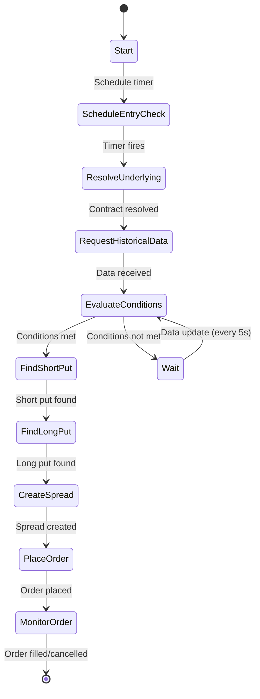
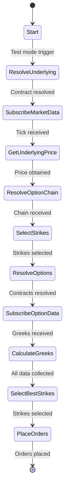

# Sample Bots Documentation

This document provides detailed explanations of the sample bots included in the framework, demonstrating different trading strategies and implementation patterns.

## Table of Contents

1. [FKK Bot (Bull Put Spread)](#fkk-bot-bull-put-spread)
2. [Double Calendar Bot](#double-calendar-bot)
3. [Common Patterns](#common-patterns)

---

## FKK Bot (Bull Put Spread)

**Location**: [`src/bots/fkk/`](../src/bots/fkk/)

**Strategy**: "Für kleine Konten" (For Small Accounts) - A bull put spread strategy on SPX that enters when specific market conditions are met.

### Strategy Overview

The FKK bot implements a systematic bull put spread strategy with the following characteristics:

- **Underlying**: SPX (S&P 500 Index)
- **Structure**: Bull put spread (sell higher strike put, buy lower strike put)
- **Entry Timing**: Configurable time (default: 14:15 ET)
- **Entry Conditions**:
  - SPX closes above its 5-day SMA
  - Intraday move up >= 0.3% (configurable)
- **Delta Target**: -0.35 (configurable) for short put
- **Spread Width**: 5-10 points (configurable)
- **Expiration**: Same-day expiration (0DTE)

### Configuration

**File**: [`config/default/fkk-2015-5.yaml`](../config/default/fkk-2015-5.yaml)

```yaml
bot_name: "fkk-1915-10"
bot_type: "fkk"
log_level: "INFO"
timezone: "America/New_York"
entry_time: "14:15:00"
entry_time_observation_period: 300  # 5 minutes
delta: -0.35
width: 10
sma_period: 5
intraday_move_pct: 0.3
test_mode: false
force_open_position: false
```

**Configuration Fields**:
- `entry_time`: Time to check entry conditions (HH:MM:SS format)
- `entry_time_observation_period`: Seconds to observe market before deciding
- `delta`: Target delta for short put leg
- `width`: Strike width between short and long puts
- `sma_period`: Period for Simple Moving Average calculation
- `intraday_move_pct`: Minimum intraday percentage move required
- `test_mode`: Enable immediate testing (triggers in 3 seconds)
- `force_open_position`: Skip entry condition checks

### Implementation Flow



### Key Implementation Details

#### 1. Start Phase

```python
def start(self):
    """Schedule entry check based on configuration."""
    tz = pytz.timezone(self.config.timezone)
    now = datetime.now(tz)
    
    if self.config.test_mode:
        # Test mode: trigger in 3 seconds
        entry_datetime = now + timedelta(seconds=3)
    else:
        # Normal mode: schedule for configured time
        entry_time = self.config.entry_time
        entry_datetime = datetime.strptime(entry_time, "%H:%M:%S").replace(
            tzinfo=tz, year=now.year, month=now.month, day=now.day
        )
        
        if entry_datetime < now:
            entry_datetime += timedelta(days=1)
    
    trigger_time = entry_datetime.strftime("%Y-%m-%d %H:%M:%S") + f" {tz_name}"
    self.timer_manager.add_timer(
        self.config.bot_name, 
        "confirm_entry_conditions", 
        self.on_timer, 
        trigger_time=trigger_time
    )
```

#### 2. Contract Resolution

```python
def on_confirm_entry_conditions(self):
    """Resolve SPX contract and check trading hours."""
    self.underlying_contract = Contract()
    self.underlying_contract.symbol = "SPX"
    self.underlying_contract.secType = "IND"
    self.underlying_contract.exchange = ""
    self.underlying_contract.currency = "USD"
    
    self.resolve_contracts(
        search_contract=self.underlying_contract,
        status=self.underlying_contract_resolution_status,
        callback=self.on_confirm_entry_conditions_on_underlying_contract_resolved
    )
```

#### 3. Trading Hours Validation

```python
def on_confirm_entry_conditions_on_underlying_contract_resolved(
    self, status, result_contracts
):
    """Validate market is open using IB's trading hours."""
    if len(result_contracts) == 1:
        self.underlying_contract_details = result_contracts[0]
        self.underlying_contract = self.underlying_contract_details.contract
        
        # Get timezone from IB
        ib_tz = get_ib_timezone(self.underlying_contract_details.timeZoneId)
        now_in_exchange_tz = datetime.now(ib_tz)
        
        # Parse trading hours: "YYYYMMDD:HHMM-YYYYMMDD:HHMM;..."
        todays_hours = self.underlying_contract_details.tradingHours.split(";")[0]
        start_str, end_str = todays_hours.split("-")
        start_dt = datetime.strptime(start_str, "%Y%m%d:%H%M").replace(tzinfo=ib_tz)
        end_dt = datetime.strptime(end_str, "%Y%m%d:%H%M").replace(tzinfo=ib_tz)
        
        if start_dt <= now_in_exchange_tz <= end_dt:
            self.logger.info("Market is open, proceeding...")
            # Request historical data
        else:
            self.logger.info("Market is closed")
```

#### 4. Historical Data & Entry Conditions

```python
def request_historical_data(self):
    """Request historical bars for SMA calculation."""
    self.historical_data_req_id = self.request_historical_data(
        contract=self.underlying_contract,
        end_datetime="",
        duration=f"{self.config.sma_period} D",
        bar_size="1 day",
        what_to_show="TRADES",
        use_rth=1,
        keep_up_to_date=True,  # Receive updates every 5 seconds
        callback_historical_data_end=self.on_historical_data_end,
        callback_historical_data_update=self.on_historical_data_update
    )

def evaluate_entry_conditions(self):
    """Check if entry conditions are met."""
    if len(self.historical_bars) < self.config.sma_period:
        return
    
    # Calculate SMA
    last_closes = [bar.close for bar in self.historical_bars[-self.config.sma_period:]]
    sma = sum(last_closes) / len(last_closes)
    
    # Current bar
    current_bar = self.historical_bars[-1]
    close = current_bar.close
    open_price = current_bar.open
    
    # Check conditions
    above_sma = close > sma
    intraday_move = close > (1 + self.config.intraday_move_pct / 100) * open_price
    
    if (above_sma and intraday_move) or self.config.force_open_position:
        self.on_entry_conditions_are_met()
```

#### 5. Option Selection Using OptionsFinder

```python
def on_entry_conditions_are_met(self):
    """Find short put using OptionsFinder."""
    today = date.today()
    expiration_str = today.strftime("%Y%m%d")
    underlying_price = self.historical_bars[-1].close
    
    # Find short put by delta
    self.options_finder.find_option_by_delta(
        underlying=self.underlying_contract,
        underlying_price=underlying_price,
        target_delta=self.config.delta,  # -0.35
        right="P",
        expiration=expiration_str,
        callback=self.on_short_contract_found,
        exchange="CBOE",
        trading_class="SPXW",
        timeout_ms=15000
    )

def on_short_contract_found(self, contract, greeks):
    """Callback when short put is found."""
    if contract is None:
        self.logger.error("Failed to find short put")
        return
    
    self.short_contract = contract
    self.logger.info(f"Short put: strike={contract.strike}, delta={greeks.delta:.4f}")
    
    # Find long put
    self.select_long_contract()

def select_long_contract(self):
    """Find long put at specified width below short strike."""
    long_strike = self.short_contract.strike - self.config.width
    
    # Create contract specification
    long_contract_spec = Contract()
    long_contract_spec.symbol = self.underlying_contract.symbol
    long_contract_spec.secType = "OPT"
    long_contract_spec.exchange = "SMART"
    long_contract_spec.currency = "USD"
    long_contract_spec.lastTradeDateOrContractMonth = self.short_contract.lastTradeDateOrContractMonth
    long_contract_spec.strike = long_strike
    long_contract_spec.right = "P"
    
    # Resolve contract
    self.resolve_contracts(
        search_contract=long_contract_spec,
        status=ContractResolutionStatus(),
        callback=self.on_long_contract_resolved
    )
```

#### 6. Spread Order Creation

```python
def create_and_place_spread_order(self):
    """Create BAG contract and place spread order."""
    from ibapi.contract import ComboLeg
    
    # Create spread contract
    spread = Contract()
    spread.symbol = self.underlying_contract.symbol
    spread.secType = "BAG"
    spread.currency = "USD"
    spread.exchange = "SMART"
    
    # Short leg
    leg1 = ComboLeg()
    leg1.conId = self.short_contract.conId
    leg1.ratio = 1
    leg1.action = "SELL"
    leg1.exchange = "SMART"
    
    # Long leg
    leg2 = ComboLeg()
    leg2.conId = self.long_contract.conId
    leg2.ratio = 1
    leg2.action = "BUY"
    leg2.exchange = "SMART"
    
    spread.comboLegs = [leg1, leg2]
    
    # Create order
    order = Order()
    order.action = "BUY"  # BUY the spread
    order.orderType = "LMT"
    order.totalQuantity = 1
    order.lmtPrice = self.calculate_spread_price()
    order.tif = "DAY"
    order.orderRef = "FKK Entry"
    
    # Place order
    order_id = self.place_order(spread, order)
```

### Key Features

1. **Timezone-Aware Scheduling**: Uses IB's timezone information for accurate timing
2. **Market Hours Validation**: Checks trading hours before attempting entry
3. **Real-time Condition Monitoring**: Updates every 5 seconds via `keepUpToDate`
4. **OptionsFinder Integration**: Leverages caching and delta-based selection
5. **Test Mode**: Allows immediate testing without waiting for scheduled time

---

## Double Calendar Bot

**Location**: [`src/bots/double_calendar/`](../src/bots/double_calendar/)

**Strategy**: A double calendar spread strategy that sells near-term options and buys longer-term options at strikes around the current price.

### Strategy Overview

- **Underlying**: SPX (S&P 500 Index)
- **Structure**: Calendar spreads (sell near-term, buy far-term)
- **Legs**: Both put and call calendars
- **Strike Selection**: Based on delta and proximity to current price
- **Expirations**: 
  - Near-term: ~7 days out
  - Far-term: ~10 days out

### Configuration

```yaml
bot_name: "double-calendar-DC57"
bot_type: "double_calendar"
log_level: "INFO"
timezone: "UTC"
test_mode: true

**Note**: The Double Calendar bot inherits `timezone` from [`ConfigBase`](../src/bots/config_base.py). You can configure the timezone as shown above (defaults to UTC if not specified).
```

### Implementation Flow



### Key Implementation Details

#### 1. Underlying Resolution and Price Discovery

```python
def test_start(self):
    """Start the bot in test mode."""
    underlying = Contract()
    underlying.symbol = "SPX"
    underlying.secType = "IND"
    underlying.exchange = "CBOE"
    underlying.currency = "USD"
    
    self.resolve_contracts(
        search_contract=underlying,
        status=self.underlying_contract_resolution_status,
        callback=self.on_underlying_contract_resolved
    )

def on_underlying_contract_resolved(self, status, result_contracts):
    """Subscribe to market data for underlying."""
    if len(result_contracts) > 0:
        self.underlying = result_contracts[0].contract
        self.underlying_market_data_req_id = self.subscribe_market_data(
            self.underlying
        )

def tick_price(self, reqId, tickType, price, attrib):
    """Process underlying price and trigger option chain resolution."""
    if reqId == self.underlying_market_data_req_id:
        pricedata = self.get_cached_price(self.underlying.conId)
        
        if TickTypeEnum.BID in pricedata and TickTypeEnum.ASK in pricedata:
            if pricedata[TickTypeEnum.BID] <= 0 or pricedata[TickTypeEnum.ASK] <= 0:
                self.underlying_price = pricedata[TickTypeEnum.CLOSE]
            else:
                self.underlying_price = (
                    pricedata[TickTypeEnum.BID] + pricedata[TickTypeEnum.ASK]
                ) / 2
            
            self.logger.info(f"Underlying price: {self.underlying_price}")
            self.unsubscribe_market_data(self.underlying)
            
            # Resolve option chain
            self.resolve_option_chain(
                underlying=self.underlying,
                callback=self.on_option_chain_resolved,
                timeout=4000
            )
```

#### 2. Option Chain Processing

```python
def on_option_chain_resolved(self, option_chain_data):
    """Process option chain and select expirations."""
    self.option_chain_data = option_chain_data
    
    # Calculate expirations
    today = datetime.now()
    expiration1 = today + timedelta(days=7)
    expiration2 = today + timedelta(days=10)
    
    # Adjust for weekends
    if expiration2.weekday() == 5:  # Saturday
        expiration2 += timedelta(days=2)
    elif expiration2.weekday() == 6:  # Sunday
        expiration2 += timedelta(days=1)
    
    self.expiration1_str = expiration1.strftime("%Y%m%d")
    self.expiration2_str = expiration2.strftime("%Y%m%d")
    
    # Filter for SPXW options at CBOE
    filtered_chains = [
        option for option in option_chain_data
        if (self.expiration1_str in option["expirations"] or 
            self.expiration2_str in option["expirations"])
        and option["exchange"] == "CBOE"
        and option["tradingClass"] == "SPXW"
    ]
    
    # Select strikes around current price
    self.select_strikes(filtered_chains)
```

#### 3. Strike Selection and Contract Resolution

```python
def select_strikes(self, filtered_chains):
    """Select strikes for puts and calls."""
    # For puts: strikes below current price
    put_strikes = sorted([
        strike for strike in filtered_chains[0]["strikes"]
        if strike < self.underlying_price
    ], reverse=True)[:10]
    
    # For calls: strikes above current price
    call_strikes = sorted([
        strike for strike in filtered_chains[0]["strikes"]
        if strike > self.underlying_price
    ])[:10]
    
    # Resolve contracts for selected strikes
    self._resolve_option_contracts(put_strikes, "P", self.expiration1_str)
    self._resolve_option_contracts(put_strikes, "P", self.expiration2_str)
    self._resolve_option_contracts(call_strikes, "C", self.expiration1_str)
    self._resolve_option_contracts(call_strikes, "C", self.expiration2_str)

def _resolve_option_contracts(self, strikes, right, expiration_str):
    """Resolve option contracts for given strikes."""
    for strike in strikes:
        contract = Contract()
        contract.symbol = "SPX"
        contract.secType = "OPT"
        contract.exchange = "SMART"
        contract.currency = "USD"
        contract.lastTradeDateOrContractMonth = expiration_str
        contract.strike = strike
        contract.right = right
        
        status = ContractResolutionStatus()
        self.resolve_contracts(
            search_contract=contract,
            status=status,
            callback=self.on_option_contract_resolved
        )
        self.pending_contract_resolutions.append(status)
```

#### 4. Greeks Collection and Strike Selection

```python
def on_option_contract_resolved(self, status, result_contracts):
    """Subscribe to market data for resolved contracts."""
    if status in self.pending_contract_resolutions:
        self.pending_contract_resolutions.remove(status)
        
        # Subscribe with greeks
        req_id = self.subscribe_market_data(
            result_contracts[0].contract,
            "10,11,12,13,101,106"  # Request greeks
        )
        
        self.option_contracts.append(result_contracts[0].contract)
        self.option_market_data_req_ids[req_id] = result_contracts[0].contract

def tick_option_computation(self, reqId, tickType, tickAttrib, impliedVol,
                            delta, optPrice, pvDividend, gamma, vega, 
                            theta, undPrice):
    """Collect option greeks."""
    if reqId in self.option_market_data_req_ids:
        contract = self.option_market_data_req_ids[reqId]
        self.option_prices[contract.conId] = self.get_cached_price(
            contract.conId
        ).copy()
        
        self.unsubscribe_market_data(contract=contract)
        self.option_market_data_req_ids.pop(reqId)
    
    if len(self.option_market_data_req_ids) == 0:
        self.logger.info("All option prices and greeks received")
        self.select_final_strikes()
```

### Key Features

1. **Dynamic Expiration Selection**: Automatically selects appropriate expirations
2. **Weekend Adjustment**: Handles weekend expiration dates
3. **Greeks-Based Selection**: Uses delta and other greeks for strike selection
4. **Batch Contract Resolution**: Efficiently resolves multiple contracts
5. **Market Data Multiplexing**: Leverages framework's multiplexing for efficiency

---

## Common Patterns

### Pattern 1: Asynchronous Contract Resolution

Both bots use the same pattern for resolving contracts:

```python
# 1. Create contract specification
contract = Contract()
contract.symbol = "SPX"
contract.secType = "IND"
# ... set other fields

# 2. Create status tracker
status = ContractResolutionStatus()

# 3. Request resolution with callback
self.resolve_contracts(
    search_contract=contract,
    status=status,
    callback=self.on_contract_resolved
)

# 4. Handle result in callback
def on_contract_resolved(self, status, contracts):
    if status.complete and len(contracts) > 0:
        # Use resolved contract
        self.my_contract = contracts[0].contract
    else:
        # Handle error
        self.logger.error(f"Resolution failed: {status.errors}")
```

### Pattern 2: Market Data Subscription

```python
# Subscribe
req_id = self.subscribe_market_data(contract, generic_tick_list)
self.my_req_id = req_id

# Handle updates
def tick_price(self, reqId, tickType, price, attrib):
    if reqId == self.my_req_id:
        # Process price update
        pass

# Cleanup
self.unsubscribe_market_data(contract)
```

### Pattern 3: Timer-Based Operations

```python
# Schedule operation
tz = pytz.timezone(self.config.timezone)
trigger_time = datetime.now(tz) + timedelta(hours=1)
trigger_str = trigger_time.strftime("%Y-%m-%d %H:%M:%S") + f" {self.config.timezone}"

timer_id = self.timer_manager.add_timer(
    bot_id=self.config.bot_name,
    event_name="my_event",
    callback=self.on_timer,
    trigger_time=trigger_str
)

# Handle timer event
def on_timer(self, event_name, event_data):
    if event_name == "my_event":
        self.handle_my_event()
```

### Pattern 4: OptionsFinder Usage

```python
# Find option by delta
self.options_finder.find_option_by_delta(
    underlying=self.underlying_contract,
    underlying_price=current_price,
    target_delta=-0.35,
    right="P",
    expiration="20260515",
    callback=self.on_option_found,
    exchange="CBOE",
    trading_class="SPXW",
    timeout_ms=15000
)

# Handle result
def on_option_found(self, contract, greeks):
    if contract:
        self.logger.info(f"Found: {contract.localSymbol}, delta={greeks.delta}")
        # Use contract
    else:
        self.logger.warning("No suitable option found")
```

### Pattern 5: Spread Order Creation

```python
from ibapi.contract import ComboLeg

# Create BAG contract
spread = Contract()
spread.symbol = underlying.symbol
spread.secType = "BAG"
spread.currency = "USD"
spread.exchange = "SMART"

# Add legs
leg1 = ComboLeg()
leg1.conId = short_contract.conId
leg1.ratio = 1
leg1.action = "SELL"
leg1.exchange = "SMART"

leg2 = ComboLeg()
leg2.conId = long_contract.conId
leg2.ratio = 1
leg2.action = "BUY"
leg2.exchange = "SMART"

spread.comboLegs = [leg1, leg2]

# Place order
order = Order()
order.action = "BUY"  # BUY the spread
order.orderType = "LMT"
order.totalQuantity = quantity
order.lmtPrice = limit_price

order_id = self.place_order(spread, order)
```

## Learning from Sample Bots

### What to Study

1. **FKK Bot** - Learn:
   - Timer-based entry logic
   - Historical data analysis
   - Entry condition evaluation
   - OptionsFinder integration
   - Spread order creation

2. **Double Calendar Bot** - Learn:
   - Option chain processing
   - Multiple contract resolution
   - Greeks-based selection
   - Dynamic expiration handling
   - Batch operations

### Extending the Bots

You can extend these bots by:

1. **Adding Exit Logic**: Implement profit targets and stop losses
2. **Position Management**: Track and manage multiple positions
3. **Risk Management**: Add position sizing and risk limits
4. **Performance Tracking**: Log and analyze trade results
5. **Alert System**: Add notifications for important events

## Next Steps

- Review [Framework Overview](./FRAMEWORK_OVERVIEW.md) for architecture
- Study [Bot Development Guide](./BOT_DEVELOPMENT_GUIDE.md) for creating your own bots
- Examine the actual bot source code for implementation details