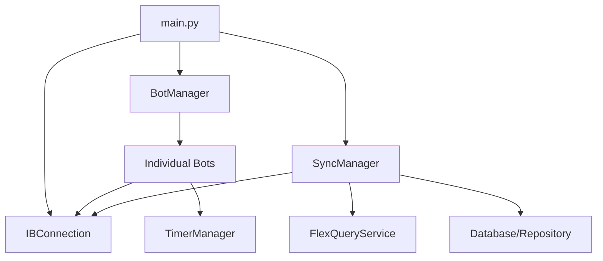

# System Patterns

## Architecture Overview
The system follows a modular architecture centered around a core connection layer that multiplexes Interactive Brokers API requests.

## Key Components

### 1. Core Connection (`IBConnection`)
- Inherits from `EWrapper` and `EClient` (IBAPI).
- **Responsibility**: Maintains the socket connection, handles incoming callbacks, and caches real-time state (positions, orders, account values).
- **Pattern**: Request Multiplexing. It uses `req_id` to route responses back to the appropriate listeners. Market data is shared by `conId`.

### 2. Bot Management (`BotManager`)
- **Responsibility**: Discovers bots in the configuration directory, instantiates them based on YAML configs, and manages their lifecycle.
- **Pattern**: Dynamic loading using `importlib`.

### 3. Data Synchronization (`SyncManager`)
- **Responsibility**: Ensures the local database and memory state are in sync with IBKR.
- **Logic**:
    1. Full sync (first run) or Incremental sync.
    2. Fetch historical data via `FlexQueryService`.
    3. Fetch real-time executions via `IBConnection`.
    4. Reconcile "Shadow Positions".

### 4. Scheduling (`TimerManager`)
- **Responsibility**: Manages CRON and one-time timers.
- **Feature**: Timezone awareness using `pytz`.

## Design Patterns

- **Asynchronous/Callback-driven**: The IBAPI is inherently asynchronous. The framework uses callbacks to handle data updates without blocking.
- **Repository Pattern**: `Repository` class abstracts database operations for trades, positions, and analytics.
- **Base Class Inheritance**: All bots inherit from `BaseBot`, ensuring a consistent interface and shared utilities.
- **Account Isolation**: Data is filtered by a `selected_account` to allow running the framework against specific accounts in a multi-account setup.

## Data Flow
1. `IBConnection` receives a raw callback (e.g., `tickPrice`).
2. It updates its internal `market_data` cache.
3. It notifies all registered `request_listeners` for that `reqId`.
4. Bots process the data and may call `IBConnection` to place orders or update state.
